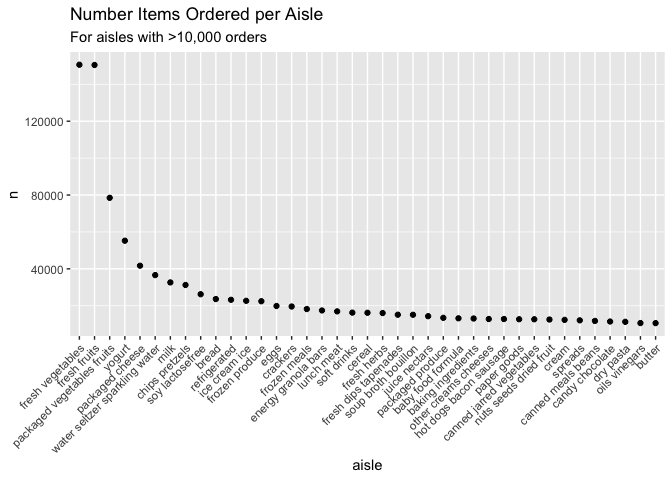

p8105\_hw3\_lr2854
================
Lauren Richter
2021-10-20

## Problem 1

``` r
data("instacart") # load in instacart dataset
```

The Instacart dataset is 1384617 x 15. The variable names are order\_id,
product\_id, add\_to\_cart\_order, reordered, user\_id, eval\_set,
order\_number, order\_dow, order\_hour\_of\_day,
days\_since\_prior\_order, product\_name, aisle\_id, department\_id,
aisle, department.

The data consists of individual order information, including the order
number, the product being ordered (a numeric ID and string name), the
order an item was added to the cart, the user who ordered, the time the
order was placed (day of the week as an ordinal number and hour of the
day), whether the item had been reordered (binary), and the location of
the item (department and aisle as numeric ID and string). There is also
a variable that defines whether the observation is in the train or test
set for model validation.

Example product names: Bulgarian Yogurt, Organic 4% Milk Fat Whole Milk
Cottage Cheese, Organic Celery Hearts, Cucumber Kirby, Lightly Smoked
Sardines in Olive Oil, Bag of Organic Bananas.

Example department names: dairy eggs, produce, canned goods.

# Problem 1 Questions

-   **How many aisles are there, and which aisles are the most items
    ordered from?**

``` r
top_aisles = instacart %>% 
  count(aisle) %>%  # group by aisle
  arrange(desc(n)) %>% # sort the table by descending number of orders
  head(5)  # show top 5
```

There are 134 aisles. The top 5 most-ordered-from aisles in descending
order are: fresh vegetables, fresh fruits, packaged vegetables fruits,
yogurt, packaged cheese

-   **Make a plot that shows the number of items ordered in each aisle,
    limiting this to aisles with more than 10000 items ordered. Arrange
    aisles sensibly, and organize your plot so others can read it.**

``` r
instacart %>% 
  count(aisle) %>% 
  filter(n > 10000) %>% 
  mutate(aisle = fct_reorder(aisle, desc(n))) %>% # descending sort
  ggplot(aes(x = aisle, y = n)) + 
  geom_point() + 
  labs(title = "Number Items Ordered per Aisle", subtitle = "For aisles with >10,000 orders") +
  theme(axis.text.x = element_text(angle = 45, hjust = 1))
```

<!-- -->

-   **Make a table showing the three most popular items in each of the
    aisles “baking ingredients”, “dog food care”, and “packaged
    vegetables fruits”. Include the number of times each item is ordered
    in your table.**

``` r
baking_ings = instacart %>%
  filter(aisle == "baking ingredients") %>%
  count(product_name) %>%
  arrange(desc(n))

knitr::kable(head(baking_ings,3), caption = "Top 3 Products from the Baking Ingredients Aisle")
```

| product\_name     |   n |
|:------------------|----:|
| Light Brown Sugar | 499 |
| Pure Baking Soda  | 387 |
| Cane Sugar        | 336 |

Top 3 Products from the Baking Ingredients Aisle

``` r
dog_food = instacart %>%
  filter(aisle == "dog food care") %>%
  count(product_name) %>%
  arrange(desc(n))

knitr::kable(head(dog_food,3), caption = "Top 3 Products from the Dog Food Care Aisle")
```

| product\_name                                 |   n |
|:----------------------------------------------|----:|
| Snack Sticks Chicken & Rice Recipe Dog Treats |  30 |
| Organix Chicken & Brown Rice Recipe           |  28 |
| Small Dog Biscuits                            |  26 |

Top 3 Products from the Dog Food Care Aisle

``` r
pack_vegs_fruits = instacart %>%
  filter(aisle == "packaged vegetables fruits") %>%
  count(product_name) %>%
  arrange(desc(n))

knitr::kable(head(pack_vegs_fruits,3), caption = "Top 3 Products from the Packaged Vegetables and Fruits Aisle")
```

| product\_name        |    n |
|:---------------------|-----:|
| Organic Baby Spinach | 9784 |
| Organic Raspberries  | 5546 |
| Organic Blueberries  | 4966 |

Top 3 Products from the Packaged Vegetables and Fruits Aisle

-   **Make a table showing the mean hour of the day at which Pink Lady
    Apples and Coffee Ice Cream are ordered on each day of the week;
    format this table for human readers (i.e. produce a 2 x 7 table).**

``` r
instacart %>%
  filter(product_name == c("Pink Lady Apples", "Coffee Ice Cream")) %>%
  group_by(product_name, order_dow) %>%
  summarize(mean_hour = mean(order_hour_of_day)) %>%
  mutate(
    order_dow = recode(
      order_dow, 
      "0" = "Sun", 
      "1" = "Mon", 
      "2" = "Tues",
      "3" = "Wed", 
      "4" = "Thurs", 
      "5" = "Fri", 
      "6" = "Sat")
    ) %>%
  pivot_wider(
    names_from = order_dow, 
    values_from = mean_hour) %>%
  
knitr::kable(digits = 0, caption = "Mean Hour of the Day (24h) when Pink Lady Apples and Coffee Ice Cream Are Ordered by Day of the Week")
## `summarise()` has grouped output by 'product_name'. You can override using the `.groups` argument.
```

| product\_name    | Sun | Mon | Tues | Wed | Thurs | Fri | Sat |
|:-----------------|----:|----:|-----:|----:|------:|----:|----:|
| Coffee Ice Cream |  13 |  15 |   15 |  15 |    15 |  10 |  12 |
| Pink Lady Apples |  12 |  12 |   12 |  14 |    12 |  14 |  12 |

Mean Hour of the Day (24h) when Pink Lady Apples and Coffee Ice Cream
Are Ordered by Day of the Week
