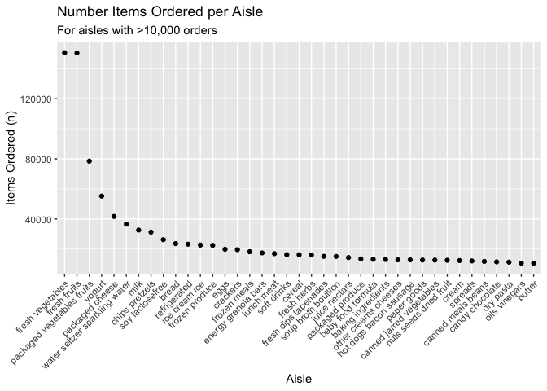
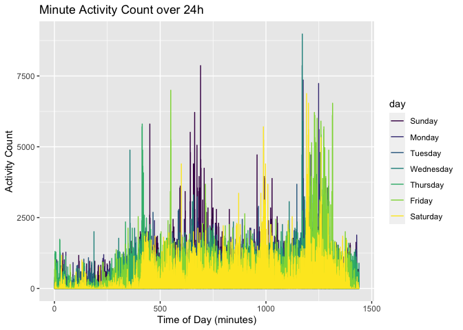

p8105\_hw3\_lr2854
================
Lauren Richter
2021-10-20

# Problem 1

``` r
data("instacart") # load in instacart dataset
```

The Instacart dataset is 1384617 x 15. The variable names are order\_id,
product\_id, add\_to\_cart\_order, reordered, user\_id, eval\_set,
order\_number, order\_dow, order\_hour\_of\_day,
days\_since\_prior\_order, product\_name, aisle\_id, department\_id,
aisle, department.

The data consists of individual order information, including the order
number, the product being ordered (a numeric ID and string name), the
order an item was added to the cart, the user who ordered, the time the
order was placed (day of the week as an ordinal number and hour of the
day), whether the item had been reordered (binary), and the location of
the item (department and aisle as numeric ID and string). There is also
a variable that defines whether the observation is in the train or test
set for model validation.

Example product names: Bulgarian Yogurt, Organic 4% Milk Fat Whole Milk
Cottage Cheese, Organic Celery Hearts, Cucumber Kirby, Lightly Smoked
Sardines in Olive Oil, Bag of Organic Bananas.

Example department names: dairy eggs, produce, canned goods.

## Problem 1 Questions

-   **How many aisles are there, and which aisles are the most items
    ordered from?**

``` r
top_aisles = instacart %>% 
  count(aisle) %>%  # group by aisle
  arrange(desc(n)) %>% # sort the table by descending number of orders
  head(5)  # show top 5
```

There are 134 aisles. The top 5 most-ordered-from aisles in descending
order are: fresh vegetables, fresh fruits, packaged vegetables fruits,
yogurt, packaged cheese

-   **Make a plot that shows the number of items ordered in each aisle,
    limiting this to aisles with more than 10000 items ordered. Arrange
    aisles sensibly, and organize your plot so others can read it.**

``` r
instacart %>% 
  count(aisle) %>% 
  filter(n > 10000) %>% 
  mutate(aisle = fct_reorder(aisle, desc(n))) %>% # descending sort
  ggplot(aes(x = aisle, y = n)) + 
  geom_point() + 
  labs(
    title = "Number Items Ordered per Aisle", subtitle = "For aisles with >10,000 orders",
    x = "Aisle",
    y = "Items Ordered (n)") +
  theme(axis.text.x = element_text(angle = 45, hjust = 1))
```

<!-- -->

-   **Make a table showing the three most popular items in each of the
    aisles “baking ingredients”, “dog food care”, and “packaged
    vegetables fruits”. Include the number of times each item is ordered
    in your table.**

``` r
baking_ings = instacart %>%
  filter(aisle == "baking ingredients") %>%
  count(product_name) %>%
  arrange(desc(n))

knitr::kable(head(baking_ings,3), caption = "Top 3 Products from the Baking Ingredients Aisle")
```

| product\_name     |   n |
|:------------------|----:|
| Light Brown Sugar | 499 |
| Pure Baking Soda  | 387 |
| Cane Sugar        | 336 |

Top 3 Products from the Baking Ingredients Aisle

``` r
dog_food = instacart %>%
  filter(aisle == "dog food care") %>%
  count(product_name) %>%
  arrange(desc(n))

knitr::kable(head(dog_food,3), caption = "Top 3 Products from the Dog Food Care Aisle")
```

| product\_name                                 |   n |
|:----------------------------------------------|----:|
| Snack Sticks Chicken & Rice Recipe Dog Treats |  30 |
| Organix Chicken & Brown Rice Recipe           |  28 |
| Small Dog Biscuits                            |  26 |

Top 3 Products from the Dog Food Care Aisle

``` r
pack_vegs_fruits = instacart %>%
  filter(aisle == "packaged vegetables fruits") %>%
  count(product_name) %>%
  arrange(desc(n))

knitr::kable(head(pack_vegs_fruits,3), caption = "Top 3 Products from the Packaged Vegetables and Fruits Aisle")
```

| product\_name        |    n |
|:---------------------|-----:|
| Organic Baby Spinach | 9784 |
| Organic Raspberries  | 5546 |
| Organic Blueberries  | 4966 |

Top 3 Products from the Packaged Vegetables and Fruits Aisle

-   **Make a table showing the mean hour of the day at which Pink Lady
    Apples and Coffee Ice Cream are ordered on each day of the week;
    format this table for human readers (i.e. produce a 2 x 7 table).**

``` r
instacart %>%
  filter(product_name %in% c("Pink Lady Apples", "Coffee Ice Cream")) %>%
  group_by(product_name, order_dow) %>%
  summarize(mean_hour = mean(order_hour_of_day)) %>%
  mutate(
    order_dow = recode(
      order_dow, 
      "0" = "Sun", 
      "1" = "Mon", 
      "2" = "Tues",
      "3" = "Wed", 
      "4" = "Thurs", 
      "5" = "Fri", 
      "6" = "Sat")
    ) %>%
  pivot_wider(
    names_from = order_dow, 
    values_from = mean_hour) %>%
  
knitr::kable(digits = 0, caption = "Mean Hour of the Day (24h) when Pink Lady Apples and Coffee Ice Cream Are Ordered by Day of the Week")
## `summarise()` has grouped output by 'product_name'. You can override using the `.groups` argument.
```

| product\_name    | Sun | Mon | Tues | Wed | Thurs | Fri | Sat |
|:-----------------|----:|----:|-----:|----:|------:|----:|----:|
| Coffee Ice Cream |  14 |  14 |   15 |  15 |    15 |  12 |  14 |
| Pink Lady Apples |  13 |  11 |   12 |  14 |    12 |  13 |  12 |

Mean Hour of the Day (24h) when Pink Lady Apples and Coffee Ice Cream
Are Ordered by Day of the Week

# Problem 2

``` r
data("brfss_smart2010") # load in dataset
```

First, do some data cleaning:

-   format the data to use appropriate variable names;
-   focus on the “Overall Health” topic
-   include only responses from “Excellent” to “Poor”
-   organize responses as a factor taking levels ordered from “Poor” to
    “Excellent”

``` r
# We will filter on Overall Health and the responses
# We will mutate the responses so that they're an ordered factor variable
# We will rename the location columns to state and county

brfss = brfss_smart2010 %>%
  janitor::clean_names() %>%
  filter(topic == "Overall Health") %>%
  filter(response %in% c("Poor", "Fair", "Good", "Very good", "Excellent")) %>%
  mutate(response = factor(response, 
                           levels =c("Poor", "Fair", "Good", "Very good", "Excellent"),
                           ordered = TRUE)) %>%
  rename(state = locationabbr, county = locationdesc)
```

## Problem 2 Questions

-   **In 2002, which states were observed at 7 or more locations? What
    about in 2010?**

``` r
brfss %>%
  filter(year == 2002) %>%
  group_by(state) %>%
  summarize(n_locs = n_distinct(county)) %>%
  filter(n_locs >= 7) %>%
  knitr::kable(caption = "Number of states with more than 7 locations in 2002")
```

| state | n\_locs |
|:------|--------:|
| CT    |       7 |
| FL    |       7 |
| MA    |       8 |
| NC    |       7 |
| NJ    |       8 |
| PA    |      10 |

Number of states with more than 7 locations in 2002

``` r
brfss %>%
  filter(year == 2010) %>%
  group_by(state) %>%
  summarize(n_locs = n_distinct(county)) %>%
  filter(n_locs >= 7) %>%
  knitr::kable(caption = "Number of states with more than 7 locations in 2010")
```

| state | n\_locs |
|:------|--------:|
| CA    |      12 |
| CO    |       7 |
| FL    |      41 |
| MA    |       9 |
| MD    |      12 |
| NC    |      12 |
| NE    |      10 |
| NJ    |      19 |
| NY    |       9 |
| OH    |       8 |
| PA    |       7 |
| SC    |       7 |
| TX    |      16 |
| WA    |      10 |

Number of states with more than 7 locations in 2010

-   **Construct a dataset that is limited to Excellent responses, and
    contains, year, state, and a variable that averages the data\_value
    across locations within a state. Make a “spaghetti” plot of this
    average value over time within a state (that is, make a plot showing
    a line for each state across years – the geom\_line geometry and
    group aesthetic will help).**

``` r
# Filter out only excellent responses and find the states
brfss_excellent = brfss %>%
  filter(response == "Excellent") %>%
  group_by(year,state) %>%
  summarize(avg_data_value = mean(data_value, na.rm = TRUE))
## `summarise()` has grouped output by 'year'. You can override using the `.groups` argument.
excellent_states = c(brfss_excellent$state) # get the names of the excellent states

knitr::kable(head(brfss_excellent))
```

| year | state | avg\_data\_value |
|-----:|:------|-----------------:|
| 2002 | AK    |           27.900 |
| 2002 | AL    |           18.500 |
| 2002 | AR    |           24.100 |
| 2002 | AZ    |           24.100 |
| 2002 | CA    |           22.700 |
| 2002 | CO    |           23.075 |

**Make a “spaghetti” plot of this average value over time within a state
(that is, make a plot showing a line for each state across years – the
geom\_line geometry and group aesthetic will help).**

``` r
brfss_excellent %>% 
  ggplot(aes(x = year, y = avg_data_value)) +
  geom_line(aes(group = state, color = state)) +
  labs(
    title = "Change in Average Data Value by Year ", 
    subtitle = "States with >= 1 Site with Reported \"Excellent\" Overall Health",
    y = "Average State Value",
    x = "Year"
  )
```

<!-- -->

-   **Make a two-panel plot showing, for the years 2006, and 2010,
    distribution of data\_value for responses (“Poor” to “Excellent”)
    among locations in NY State.** There were only responses of “Poor”
    and “Good”, so those are plotted.

``` r
brfss_ny = brfss %>% 
  filter(state == "NY" & (year == 2006 | year == 2010)) %>%
  group_by(year,response)

ggplot(data = brfss_ny, aes(x = response, y = data_value)) +
  geom_boxplot(aes(group = response, color = response, alpha = 0.1)) +
  geom_point(aes(group = response, color = response)) + 
  facet_grid(. ~ year) +
  labs(
    title = "Distribution of Responses in NY between 2006 and 2010",
    y = "Value",
    x = "Response") + 
  theme(axis.text.x = element_text(angle = 45, hjust = 1),
        legend.position = "none")
```

<!-- -->

# Problem 3

Accelerometer data

``` r
# for columns, replace the activity.* with minute
# make the day of the week an ordinal variable
# then pivot longer to make the df more legible

orig_accel_data = read_csv("data/accel_data.csv")
## Rows: 35 Columns: 1443
## ── Column specification ────────────────────────────────────────────────────────
## Delimiter: ","
## chr    (1): day
## dbl (1442): week, day_id, activity.1, activity.2, activity.3, activity.4, ac...
## 
## ℹ Use `spec()` to retrieve the full column specification for this data.
## ℹ Specify the column types or set `show_col_types = FALSE` to quiet this message.
accel_data = orig_accel_data %>%
  janitor::clean_names() %>%
  rename_with(~ sub("activity","minute", .x)) %>%
  mutate(weekend = ifelse(day %in% c("Saturday", "Sunday"), 1, 0)) %>% 
  mutate(day, 
         day = factor(day,
                      levels = c("Sunday", 
                                 "Monday",
                                 "Tuesday",
                                 "Wednesday", 
                                 "Thursday", 
                                 "Friday", 
                                 "Saturday"), 
                      ordered = TRUE)
         ) %>%
  pivot_longer(
    minute_1:minute_1440,
    names_to = "minute", 
    names_prefix = "minute_", 
    values_to = "activity_count"
  ) %>%
  mutate(minute, minute = as.numeric(minute))
```

The original accelerometer dataset was a wide 35 x 1443, with 1440
activity count variables corresponding to each minute of a 24h day for a
total of 35 days. Other variables in the original dataset were the week
number, the day of the week, and the day ID. After tidying, the dataset
is 50400 x 6, with the variables representing week, day\_id, day,
weekend, minute, activity\_count. The weekend variable was added as a
binary indicator of whether the day is on a weekend or not.

-   **Traditional analyses of accelerometer data focus on the total
    activity over the day. Using your tidied dataset, aggregate accross
    minutes to create a total activity variable for each day, and create
    a table showing these totals. Are any trends apparent?** There are
    no obvious trends except that there seems to be decreasing activity
    on weekends as the weeks go on.

``` r
accel_data %>%
  group_by(week, day_id, day, weekend) %>%
  summarize(total_daily_activity = sum(activity_count)) %>%
  pivot_wider(
    week,
    names_from = day,
    values_from = total_daily_activity) %>%
  select(c("week", "Sunday", "Monday", "Tuesday","Wednesday","Thursday","Friday","Saturday")) %>%
  knitr::kable()
## `summarise()` has grouped output by 'week', 'day_id', 'day'. You can override using the `.groups` argument.
```

| week | Sunday |    Monday |  Tuesday | Wednesday | Thursday |   Friday | Saturday |
|-----:|-------:|----------:|---------:|----------:|---------:|---------:|---------:|
|    1 | 631105 |  78828.07 | 307094.2 |    340115 | 355923.6 | 480542.6 |   376254 |
|    2 | 422018 | 295431.00 | 423245.0 |    440962 | 474048.0 | 568839.0 |   607175 |
|    3 | 467052 | 685910.00 | 381507.0 |    468869 | 371230.0 | 467420.0 |   382928 |
|    4 | 260617 | 409450.00 | 319568.0 |    434460 | 340291.0 | 154049.0 |     1440 |
|    5 | 138421 | 389080.00 | 367824.0 |    445366 | 549658.0 | 620860.0 |     1440 |

-   **Accelerometer data allows the inspection activity over the course
    of the day. Make a single-panel plot that shows the 24-hour activity
    time courses for each day and use color to indicate day of the week.
    Describe in words any patterns or conclusions you can make based on
    this graph.**

If you look at each day’s minute by minute trend, it is difficult to see
any patterns at this resolution, although it seems like the person is
less active on the weekends, particularly less so in the morning
compared to weekdays.

``` r
accel_data %>%
  group_by(day_id, day) %>%
  ggplot(aes(x = minute, y =activity_count)) +
  geom_line(aes(color = day, group = day, position="stacked")) +
  labs(
    title = "Minute Activity Count over 24h",
    y = "Activity Count",
    x = "Time of Day (minutes)"
  )
```

<!-- -->

However, if we log transform the activity and look at a “smoothed”
activity, this trend is clearer. The person is less active almost
universally on Saturdays compared to any other day of the week. On
weekdays, particularly Wed-Fri, the person is more active at night,
compared to other days of the week.

``` r
accel_data %>%
  group_by(day_id, day) %>%
  ggplot(aes(x = minute, y = log(activity_count))) +
  geom_smooth(se = FALSE, aes(group = day, color = day)) +
  labs(
    title = "Minute Activity Count over 24h",
    y = "log(Activity Count)",
    x = "Time of Day (minutes)"
  )
## `geom_smooth()` using method = 'gam' and formula 'y ~ s(x, bs = "cs")'
```

<!-- -->
