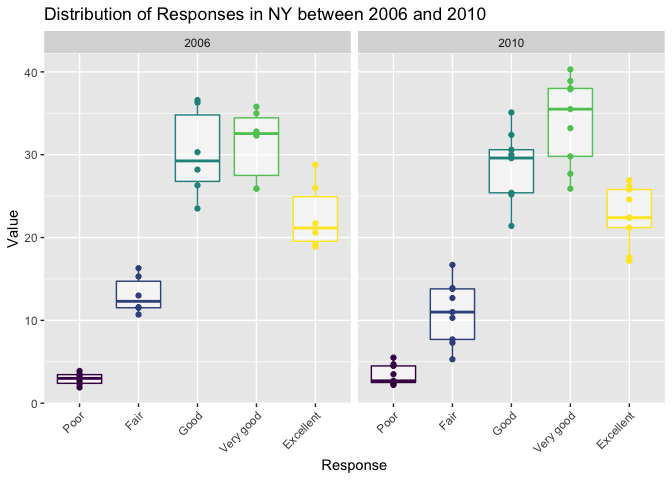

p8105\_hw3\_lr2854
================
Lauren Richter
2021-10-20

## Problem 1

``` r
data("instacart") # load in instacart dataset
```

The Instacart dataset is 1384617 x 15. The variable names are order\_id,
product\_id, add\_to\_cart\_order, reordered, user\_id, eval\_set,
order\_number, order\_dow, order\_hour\_of\_day,
days\_since\_prior\_order, product\_name, aisle\_id, department\_id,
aisle, department.

The data consists of individual order information, including the order
number, the product being ordered (a numeric ID and string name), the
order an item was added to the cart, the user who ordered, the time the
order was placed (day of the week as an ordinal number and hour of the
day), whether the item had been reordered (binary), and the location of
the item (department and aisle as numeric ID and string). There is also
a variable that defines whether the observation is in the train or test
set for model validation.

Example product names: Bulgarian Yogurt, Organic 4% Milk Fat Whole Milk
Cottage Cheese, Organic Celery Hearts, Cucumber Kirby, Lightly Smoked
Sardines in Olive Oil, Bag of Organic Bananas.

Example department names: dairy eggs, produce, canned goods.

# Problem 1 Questions

-   **How many aisles are there, and which aisles are the most items
    ordered from?**

``` r
top_aisles = instacart %>% 
  count(aisle) %>%  # group by aisle
  arrange(desc(n)) %>% # sort the table by descending number of orders
  head(5)  # show top 5
```

There are 134 aisles. The top 5 most-ordered-from aisles in descending
order are: fresh vegetables, fresh fruits, packaged vegetables fruits,
yogurt, packaged cheese

-   **Make a plot that shows the number of items ordered in each aisle,
    limiting this to aisles with more than 10000 items ordered. Arrange
    aisles sensibly, and organize your plot so others can read it.**

``` r
instacart %>% 
  count(aisle) %>% 
  filter(n > 10000) %>% 
  mutate(aisle = fct_reorder(aisle, desc(n))) %>% # descending sort
  ggplot(aes(x = aisle, y = n)) + 
  geom_point() + 
  labs(
    title = "Number Items Ordered per Aisle", subtitle = "For aisles with >10,000 orders",
    x = "Aisle",
    y = "Items Ordered (n)") +
  theme(axis.text.x = element_text(angle = 45, hjust = 1))
```

<!-- -->

-   **Make a table showing the three most popular items in each of the
    aisles “baking ingredients”, “dog food care”, and “packaged
    vegetables fruits”. Include the number of times each item is ordered
    in your table.**

``` r
baking_ings = instacart %>%
  filter(aisle == "baking ingredients") %>%
  count(product_name) %>%
  arrange(desc(n))

knitr::kable(head(baking_ings,3), caption = "Top 3 Products from the Baking Ingredients Aisle")
```

| product\_name     |   n |
|:------------------|----:|
| Light Brown Sugar | 499 |
| Pure Baking Soda  | 387 |
| Cane Sugar        | 336 |

Top 3 Products from the Baking Ingredients Aisle

``` r
dog_food = instacart %>%
  filter(aisle == "dog food care") %>%
  count(product_name) %>%
  arrange(desc(n))

knitr::kable(head(dog_food,3), caption = "Top 3 Products from the Dog Food Care Aisle")
```

| product\_name                                 |   n |
|:----------------------------------------------|----:|
| Snack Sticks Chicken & Rice Recipe Dog Treats |  30 |
| Organix Chicken & Brown Rice Recipe           |  28 |
| Small Dog Biscuits                            |  26 |

Top 3 Products from the Dog Food Care Aisle

``` r
pack_vegs_fruits = instacart %>%
  filter(aisle == "packaged vegetables fruits") %>%
  count(product_name) %>%
  arrange(desc(n))

knitr::kable(head(pack_vegs_fruits,3), caption = "Top 3 Products from the Packaged Vegetables and Fruits Aisle")
```

| product\_name        |    n |
|:---------------------|-----:|
| Organic Baby Spinach | 9784 |
| Organic Raspberries  | 5546 |
| Organic Blueberries  | 4966 |

Top 3 Products from the Packaged Vegetables and Fruits Aisle

-   **Make a table showing the mean hour of the day at which Pink Lady
    Apples and Coffee Ice Cream are ordered on each day of the week;
    format this table for human readers (i.e. produce a 2 x 7 table).**

``` r
instacart %>%
  filter(product_name == c("Pink Lady Apples", "Coffee Ice Cream")) %>%
  group_by(product_name, order_dow) %>%
  summarize(mean_hour = mean(order_hour_of_day)) %>%
  mutate(
    order_dow = recode(
      order_dow, 
      "0" = "Sun", 
      "1" = "Mon", 
      "2" = "Tues",
      "3" = "Wed", 
      "4" = "Thurs", 
      "5" = "Fri", 
      "6" = "Sat")
    ) %>%
  pivot_wider(
    names_from = order_dow, 
    values_from = mean_hour) %>%
  
knitr::kable(digits = 0, caption = "Mean Hour of the Day (24h) when Pink Lady Apples and Coffee Ice Cream Are Ordered by Day of the Week")
## `summarise()` has grouped output by 'product_name'. You can override using the `.groups` argument.
```

| product\_name    | Sun | Mon | Tues | Wed | Thurs | Fri | Sat |
|:-----------------|----:|----:|-----:|----:|------:|----:|----:|
| Coffee Ice Cream |  13 |  15 |   15 |  15 |    15 |  10 |  12 |
| Pink Lady Apples |  12 |  12 |   12 |  14 |    12 |  14 |  12 |

Mean Hour of the Day (24h) when Pink Lady Apples and Coffee Ice Cream
Are Ordered by Day of the Week

## Problem 2

``` r
data("brfss_smart2010") # load in dataset
```

First, do some data cleaning:

-   format the data to use appropriate variable names;
-   focus on the “Overall Health” topic
-   include only responses from “Excellent” to “Poor”
-   organize responses as a factor taking levels ordered from “Poor” to
    “Excellent”

``` r
brfss = brfss_smart2010 %>%
  janitor::clean_names() %>%
  filter(topic == "Overall Health") %>%
  filter(response == c("Poor", "Fair", "Good", "Very good", "Excellent")) %>%
  mutate(response = factor(response, 
                           levels =c("Poor", "Fair", "Good", "Very good", "Excellent"),
                           ordered = TRUE)) %>%
  rename(state = locationabbr, county = factor("locationdesc"))
```

\#Problem 2 Questions

-   **In 2002, which states were observed at 7 or more locations? What
    about in 2010?**

``` r
brfss %>%
  filter(year == 2002) %>%
  group_by(state) %>%
  count(state) %>%
  filter(n >= 7) %>%
  knitr::kable(caption = "States with 7 or more locations in 2002")
```

| state |   n |
|:------|----:|
| FL    |   7 |
| MA    |   8 |
| NC    |   7 |
| NJ    |   8 |
| PA    |   9 |

States with 7 or more locations in 2002

``` r
brfss %>%
  filter(year == 2010) %>%
  group_by(state) %>%
  count(state) %>%
  filter(n >= 7) %>%
  knitr::kable(caption = "States with 7 or more locations in 2010")
```

| state |   n |
|:------|----:|
| CA    |  12 |
| CO    |   7 |
| FL    |  40 |
| MA    |   9 |
| MD    |  11 |
| NC    |  12 |
| NE    |  10 |
| NJ    |  19 |
| NY    |   9 |
| OH    |   7 |
| PA    |   7 |
| TX    |  16 |
| WA    |  10 |

States with 7 or more locations in 2010

-   **Construct a dataset that is limited to Excellent responses, and
    contains, year, state, and a variable that averages the data\_value
    across locations within a state. Make a “spaghetti” plot of this
    average value over time within a state (that is, make a plot showing
    a line for each state across years – the geom\_line geometry and
    group aesthetic will help).**

``` r
brfss_excellent = brfss %>%
  filter(response == "Excellent") %>%
  # filter(is.na(data_value) == FALSE) %>% # if you want to remove NJ since it is NA
  group_by(year,state) %>%
  summarize(avg_data_value = mean(data_value))
## `summarise()` has grouped output by 'year'. You can override using the `.groups` argument.
excellent_states = c(brfss_excellent$state)

knitr::kable(brfss_excellent, caption = "Average Values of States Reporting \"Excellent\" Overall Health")
```

| year | state | avg\_data\_value |
|-----:|:------|-----------------:|
| 2002 | HI    |            18.30 |
| 2002 | MA    |            30.25 |
| 2002 | MD    |            24.60 |
| 2002 | NJ    |               NA |
| 2002 | NM    |            23.40 |
| 2002 | NY    |            27.40 |
| 2002 | PA    |            21.55 |
| 2004 | MD    |            26.20 |
| 2005 | MA    |            24.60 |
| 2006 | AR    |            18.10 |
| 2007 | NM    |            21.70 |
| 2010 | CT    |            22.80 |

Average Values of States Reporting “Excellent” Overall Health

**Make a “spaghetti” plot of this average value over time within a state
(that is, make a plot showing a line for each state across years – the
geom\_line geometry and group aesthetic will help).**

``` r
brfss %>% 
  filter(state %in% excellent_states) %>%
  group_by(year,state) %>%
  summarize(avg_data_value = mean(data_value)) %>%
  ggplot(aes(x = year, y = avg_data_value)) +
  geom_line(aes(group = state, color = state)) +
  geom_point(
    data = brfss_excellent, 
    aes(x = year, y = avg_data_value, group = state, color = state)) + 
  geom_line(
    data = brfss_excellent, 
    linetype= "dashed", 
    aes(x = year, y = avg_data_value, group = state, color = state)) +
  labs(
    title = "Change in Data Values by Year ", 
    subtitle = "States with >= 1 Site with Reported \"Excellent\" Overall Health",
    y = "Average State Value",
    x = "Year",
    caption = "Points indicate the average value for \"Excellent\" sites only"
  )
## `summarise()` has grouped output by 'year'. You can override using the `.groups` argument.
```

<!-- -->

-   **Make a two-panel plot showing, for the years 2006, and 2010,
    distribution of data\_value for responses (“Poor” to “Excellent”)
    among locations in NY State.** There were only responses of “Poor”
    and “Good”, so those are plotted.

``` r
brfss_ny = brfss %>% 
  filter(state == "NY" & year %in% c(2006,2010)) %>%
  group_by(year,response)

ggplot(data = brfss_ny, aes(x = response, y = data_value)) +
  geom_point(aes(group = response, color = response)) + 
  facet_grid(. ~ year) +
  labs(
    title = "Distribution of Responses in NY between 2006 and 2010",
    y = "Value",
    x = "Response",
    caption = "(Only 2 of 5 possible response categories were reported)"
  )
```

<!-- -->

## Problem 3

Accelerometers have become an appealing alternative to self-report
techniques for studying physical activity in observational studies and
clinical trials, largely because of their relative objectivity. During
observation periods, the devices measure “activity counts” in a short
period; one-minute intervals are common. Because accelerometers can be
worn comfortably and unobtrusively, they produce around-the-clock
observations.

This problem uses five weeks of accelerometer data collected on a 63
year-old male with BMI 25, who was admitted to the Advanced Cardiac Care
Center of Columbia University Medical Center and diagnosed with
congestive heart failure (CHF). The data can be downloaded here. In this
spreadsheet, variables activity.\* are the activity counts for each
minute of a 24-hour day starting at midnight.

Load, tidy, and otherwise wrangle the data. Your final dataset should
include all originally observed variables and values; have useful
variable names; include a weekday vs weekend variable; and encode data
with reasonable variable classes. Describe the resulting dataset
(e.g. what variables exist, how many observations, etc). Traditional
analyses of accelerometer data focus on the total activity over the day.
Using your tidied dataset, aggregate accross minutes to create a total
activity variable for each day, and create a table showing these totals.
Are any trends apparent? Accelerometer data allows the inspection
activity over the course of the day. Make a single-panel plot that shows
the 24-hour activity time courses for each day and use color to indicate
day of the week. Describe in words any patterns or conclusions you can
make based on this graph.
